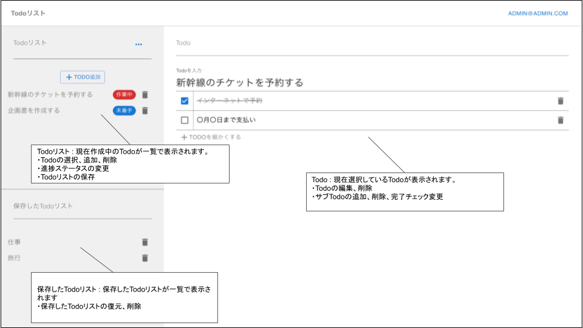

## アプリケーションの概要
Todoを管理するアプリケーションです。

<p align="center">
  
</p>


## アプリケーションの機能一覧
* Todo作成機能
* Todo削除機能
* Todo編集機能
* Todo保存機能
* ログイン機能
* ログアウト機能
* ユーザー作成機能
* ユーザー退会機能

## 使用技術
### フロントエンド
* React.js

### バックエンド
* Django REST framework

### インフラ
* AWS(CloudFront,EC2,S3,RDS)

### 開発環境
* Docker

## 開発環境(Docker)の動かし方

### 事前に必要なこと
* Dockerのインストール
* Gitリポジトリのクローン

### Dockerコンテナのビルドと起動
```
docker-compose up --build
```

### Dockerコンテナの起動確認
```
docker-compose ps
```
Stateが"UP"になっていれば正常起動している

### アプリケーションの接続
```
http://localhost/
```

## 公開URL
```
https://d6g1fi1sxdwfd.cloudfront.net/
```